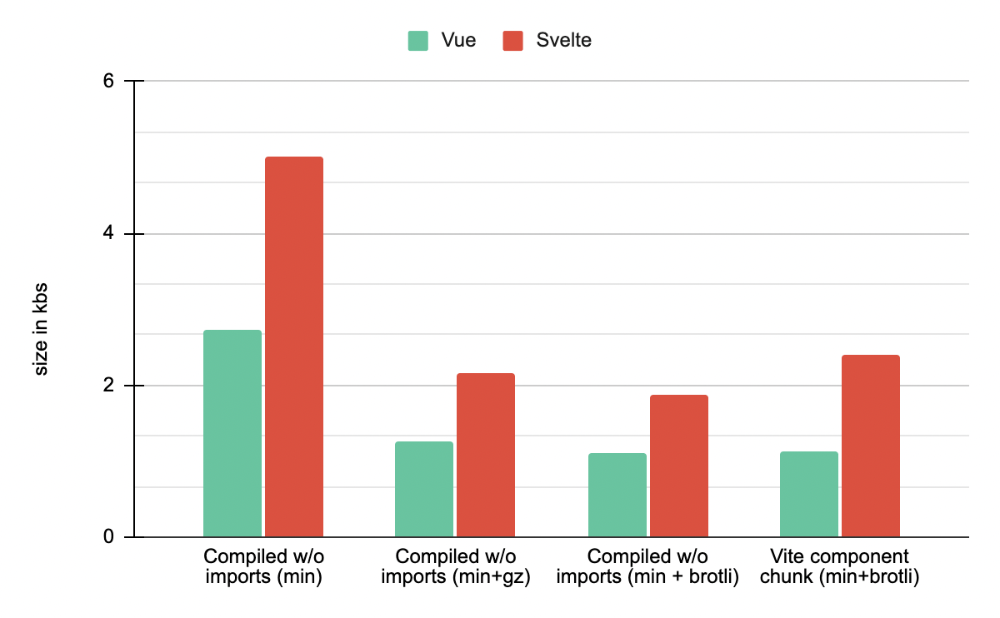

# Comparing generated code size of Vue and Svelte components

## TL;DR

1. Compiled Svelte component code is **70%** heavier than Vue 3 equivalent, and **110%** heavier in SSR mode.
2. It takes ~**19** TodoMVC-sized components (**13** in SSR scenarios) to offset the framework base runtime size difference between Vue and Svelte.

## Methodology

1. Both frameworks are used to implement a single spec-compliant, functionally-equivalent TodoMVC component.

   - Vue: [todomvc.vue](./todomvc.vue) (using `<script setup>` syntax)
   - Svelte: [todomvc.svelte](./todomvc.svelte) (based on [the official implementation](https://github.com/sveltejs/svelte-todomvc/blob/master/src/TodoMVC.svelte), removed the `uuid` function for fairness)

2. Components are compiled in isolation using each framework's online SFC compilers

   - Vue: [sfc.vuejs.org](https://sfc.vuejs.org/) @3.1.4 -> `todomvc.vue.js`
   - Svelte: [svelte.dev/repl](https://svelte.dev/repl) @3.38.3 -> `todomvc.svelte.js`

3. Compiled files are minified using [Terser REPL](https://try.terser.org/), and then have the ES imports and exports removed. This is because in a bundled app these imports/exports are either not needed or shared between multiple components.

   - Vue: `todomvc.vue.min.js`
   - Svelte: `todomvc.svelte.min.js`

4. Minified files are then compressed w/ gzip and brotli.

   - Vue: `todomvc.vue.min.js.gz` / `todomvc.vue.min.js.brotli`
   - Svelte: `todomvc.svelte.min.js.gz` / `todomvc.svelte.min.js.brotli`

5. In addition, in an SSR setting, Svelte needs to compile its components in "hydratable" mode, which results in additional generated code. Steps 2-4 are repeated for Svelte with "hydratable: true" compiler options.

   Vue produces exactly the same code in SSR settings, but imports some additional hydration-specific runtime code (~0.89kb min+brotli).

6. For each framework, a default Vite app using the component is created and the production build is run (svelte w/ `hydratable: false`). Each app is also built another time using SSR-enabled settings.

   The default Vite build splits a vendor chunk (= framework runtime code) and an index chunk (= component code).

## Results

|                                   | Vue     | Vue (SSR) | Svelte           | Svelte (SSR) |
| --------------------------------- | ------- | --------- | ---------------- | ------------------- |
| Source                            | 3.93kb  | -         | 3.31kb           | -                   |
| Compiled w/o imports (min)        | 2.73kb  | -         | 5.01kb (183.52%) | 6.59kb (241.39%)    |
| Compiled w/o imports (min+gz)     | 1.25kb  | -         | 2.13kb (170.40%) | 2.68kb (214.40%)    |
| Compiled w/o imports (min+brotli) | 1.10kb  | -         | 1.88kb (170.91%) | 2.33kb (211.82%)    |
| Vite component chunk (min+brotli) | 1.13kb  | -         | 1.95kb (172.26%) | 2.41kb (213.27%)    |
| Vite vendor chunk (min+brotli)    | 16.89kb | 17.78kb   | 1.85kb           | 2.13kb              |

## Analysis

The Svelte app imported 2.13kb min+brotli framework code, which is **15.04kb** lighter than Vue. This is the base size difference.

However, for the component code, Svelte's min + compressed output size is **~1.7x** of the Vue equivalent. In this case, a single component results in **0.78kb** of size difference. In SSR scenarios, this ratio goes up further to **~2.1x** where a single component results in a **1.23kb** size difference.

TodoMVC covers a pretty decent feature range and is generally representative of the components most users build in typical apps. We can reasonably assume that similar size difference would be found in real world scenarios. That is to say, in theory, if an app contains more than 15.04 / 0.78 ~= **19** TodoMVC-sized components, the Svelte app would end up being heavier than the Vue app.

This threshold is even lower in SSR scenarios. In SSR mode, the base difference is **15.65kb** but the compnent count threshold is down to 15.65 / 1.23 ~= **13**!

Obviously in real world apps there are many other factors at play: more features would be imported from the frameworks and 3rd party libraries will be used. The size curve would be affected by the percentage of pure component code in a project. However, it would be safe to assume that the more an app is over the 19-components threshold (or 13 in SSR mode, which most non-trivial apps would probably cross), the less likely it is for Svelte to have any real size advantage.
